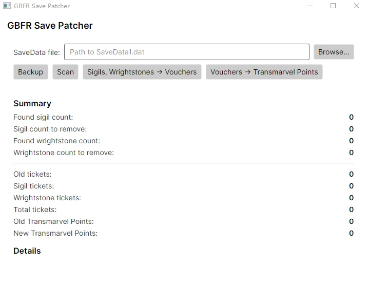

# GBFRSavePatcher

A tool that converts Sigils and Wrightstones into Knickknack Vouchers and Transmarvel Stock.


**This tool doesn’t take effect in-game immediately; after using it, please return to the title screen and reload your save.**


**This is an basic version** that can convert eligible **Sigils** and **Wrightstones** into **Knickknack Vouchers**, or directly into **Transmarvel Stock**.
**Sigil criteria:**

1. Level ≤ 11
2. Not equipped by any character
3. Not locked

**Note:** Sigils that are included in an equipment preset but not currently  equipped will be dismantled. Please review your save and lock those  Sigils.


**Wrightstone criteria:**

1. Level is **not** (20, 15, 10)
2. Not locked

You can convert these Sigils and Wrightstones into **Knickknack Vouchers**, or convert **all** Knickknack Vouchers directly into **Transmarvel Points** at a rate of **1 Knickknack Voucher = 1.33 Transmarvel Points** (**1 Transmarvel Stock = 150 Transmarvel Points**).

> (**Why 1.33?**
> This coefficient is derived from the drop probabilities of **Sigils** and **Wrightstones** in **Level 3 Transmutation**, multiplied by the number of **vouchers** they can be exchanged for.
> Source: https://nenkai.github.io/relink-modding/resources/gacha_rates/#level-3-transmutation-total-weight-10000
> There may be a certain margin of error.)


**GUI actions:**

- **Browse** → Select your save file. On Windows, the path is C:\Users\username\AppData\Local\GBFR\Saved\SaveGames\SaveData1.dat
- **Backup** → Back up SaveData1.dat in the selected directory to SaveData1_patcher_backup.dat
- **Sigils, Wrightstones → Vouchers** → Convert Sigils and Wrightstones to Knickknack Vouchers using the rules above
- **Vouchers → Transmarvel Points** → Convert Knickknack Vouchers to Transmarvel Points using the rules above


**Note:** Although the backup feature has been tested, because save files are  critical, I strongly recommend that you make a manual backup the first  time you use this tool.



**Additional notes:**
It’s recommended to use the [**Uncap Item Limit and Transmarvel Stock**](https://www.nexusmods.com/granbluefantasyrelink/mods/528) mod (or its original mod, **[Unlocking Item Limit](https://www.nexusmods.com/granbluefantasyrelink/mods/83)**) together with this tool—especially for players who:

1. Convert **Sigils** and **Wrightstones** into **Knickknack Vouchers**, since this can push your voucher count well beyond **999**.
2. Convert **Sigils** and **Wrightstones** into **Transmarvel Stock**, and your **Transmarvel Stock** exceeds **999**.

If you only convert Sigils and Wrightstones into Transmarvel Stock and the total **does not exceed 999**, you can use the tool without installing any additional mod.


**Develop Environment:**

This project requires .NET 8.0 and .NET 9.0.

Run command:

```
dotnet run --project src/GBFRSave.UI
```


**TODO (maybe):**

1. Add Chinese and Japanese translations.
2. Add item-to-currency conversion (items → Knickknack Vouchers / Transmarvel Stock).
3. Add more filtering criteria.


**Acknowledgments:**
The data structures and parsing methods are derived from the project https://github.com/Nenkai/GBFRDataTools. Many thanks to nenkai for the project.